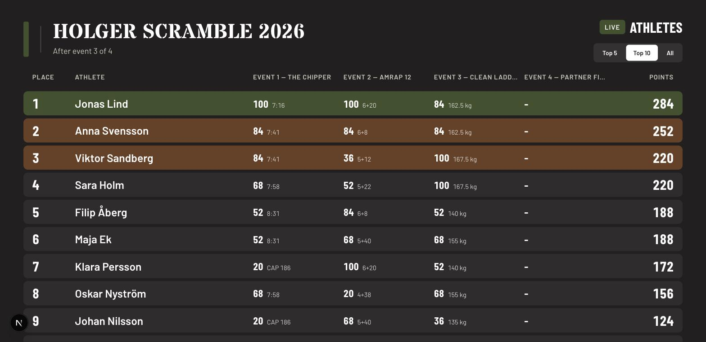
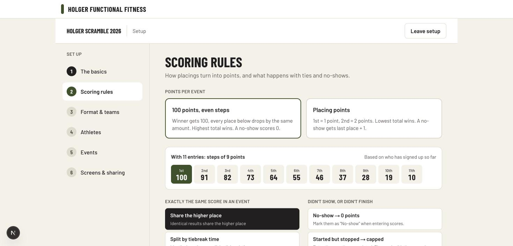
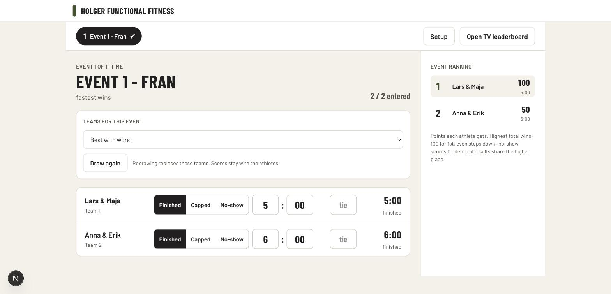

# Box Competition Scoring

Scoring and team management for a CrossFit box competition, built for
[Holger Functional Fitness](https://www.holgerfunctionalfitness.se) in Skurup, Sweden.

It handles the thing off-the-shelf software does not: **scrambled competitions**,
where teams are redrawn before every event but the points stay with the
individual athletes.



---

## The problem

A box competition is scored across several events. Most competitions keep the
same teams all day, and plenty of software handles that. A scramble does not:
before each event the athletes are drawn into new teams, the team does the
workout together and posts one result, and that result is credited to each
member individually. The winner is a person, not a team.

Nothing on the market does this. I looked first — see
[SPEC.md](SPEC.md) for what I found and why none of it was worth building on.

## What it does

**Set up a competition** — a six-step wizard covering the basics, scoring rules,
format, athletes, events and sharing. The competition is saved as a draft from
the first step, so a half-finished setup survives closing the laptop.



**Draw the teams** before each event, by:

- pure chance,
- *best with worst* — rank the standings and pair the top with the bottom, so
  every team comes out roughly even,
- *top and bottom half* — one athlete from each half of the standings.

On top of the method, the organiser can ask for teammates never to repeat,
for pairs to be mixed or same gender, and for the 60+ athletes to be spread
across teams rather than clumping. Those rules conflict with each other in
practice, so the draw does not pretend otherwise — see
[how the draw works](#how-the-draw-works) below.

**Enter scores** between heats, on a laptop. Times go into separate minutes and
seconds boxes, rounds into separate rounds and reps boxes, because that is
quicker than typing punctuation. There is no Save button: results are written as
they are typed. A running order for the event updates in a sidebar as scores
come in.



**Show the standings on a TV**, sized to fill whatever it is plugged into.

## How the scoring works

Two systems, chosen per competition:

|                | 100 points, even steps | Placing points |
| -------------- | ---------------------- | -------------- |
| Winner gets    | 100                    | 1              |
| Step per place | `floor(100 ÷ entries)` | 1              |
| Competition won by | Highest total      | Lowest total   |
| No-show gets   | 0                      | Last place + 1 |

The hundred-step system keeps a win worth the same in every event however many
took part: with 12 entries the step is 8, so the places run 100, 92, 84.

Ties inside an event are settled one of three ways, again chosen per
competition: share the higher place, split by a recorded tiebreak time, or
share the average of the places they occupy. Ties in the overall standings are
broken by the best single-event placing, then the next best.

A result is *finished*, *capped* (hit the time cap or stopped early, scored on
reps completed) or a *no-show*. Capped results rank below everyone who finished
however good the partial score was, and no-shows below that.

## How the draw works

The interesting part. The organiser's rules — no repeat teammates, mixed or
same-gender pairs, spread the 60+ athletes — routinely cannot all be satisfied
with a real set of people. Ten athletes over four events simply run out of
unused pairings.

So the draw does not try to be perfect:

1. Deal the teams out by the chosen method.
2. Score how badly the arrangement breaks the rules. The weights decide which
   rule gives way first: a repeated partner counts more than a gender mismatch,
   which counts more than 60+ athletes bunching up.
3. Try every possible swap between two teams, make the single best one, and
   repeat until no swap improves matters.
4. Report whatever is still unsatisfied, in plain words, on screen:
   *"2 pairs have been teammates before. There are not enough athletes to avoid
   it."*

Reporting the shortfall rather than hiding it is the point. The organiser can
then decide whether to accept it or change the rules.

## Running it

Requires Node 20+ and a PostgreSQL database.

```bash
npm install
cp .env.example .env.local     # then paste your database URL into it
npx prisma migrate deploy      # create the tables
npm run dev
```

| Command             | Does                                            |
| ------------------- | ----------------------------------------------- |
| `npm run dev`       | Run the app locally                             |
| `npm test`          | Unit tests — fast, no database needed           |
| `npm run e2e`       | End-to-end tests in a real browser              |
| `npm run typecheck` | Check types without building                    |
| `npm run lint`      | Lint                                            |
| `npm run build`     | Production build                                |

`npm run e2e` builds and runs its own copy of the app on port 3100, against a
separate `e2e` schema in the same database. A dev server you already have open
on port 3000 is untouched, and so is everything in it. The schema is emptied at
the start of every run.

If you would rather point the tests at a different database entirely, set
`DATABASE_URL_TEST`. Either way they refuse to run unless the url names a
schema for testing, so a bad edit cannot have them deleting real competitions.

### Branding

Colours ship in `src/lib/theme.ts` and are Holger's own, used with their
permission. **The logo files are deliberately not in this repository.** Drop
them in `public/brand/` (git-ignored) and point at them from `.env.local`:

```
BRAND_LOGO_LIGHT="/brand/logo-colour.png"
BRAND_LOGO_DARK="/brand/logo-white.png"
```

Without them the header shows a coloured bar and the competition name as text,
so nothing breaks. Every colour can be overridden the same way, so the app can
be rebranded for another gym without touching the code.

## How it is built

- **Next.js 16** and **React 19**, App Router, server components
- **PostgreSQL** via **Prisma 7**
- **Tailwind 4**
- **Node's built-in test runner** — no test framework dependency

A few decisions worth explaining:

**The leaderboard is never stored.** It is recomputed from the raw scores every
time. Correcting a typo in one result fixes the whole competition with no extra
work, and it means the scoring rules can be changed mid-competition without
migrating anything.

**Scoring, the draw and score parsing are plain functions** in `src/lib/`, with
no database or React anywhere near them. That is why they can be tested
properly: 66 unit tests cover both points systems, all three tie rules, how
capped and no-show results rank, every draw rule including the cases where the
rules cannot all be met, and the awkward parts of reading a form.

**Almost everything works without JavaScript.** Choices are radio buttons
dressed as cards; the wizard's plus and minus buttons post how far to move
rather than the result. The one exception is score entry, where the boxes have
to change the instant "Capped" is picked — waiting for the server would mean
pressing save with no reps box on screen, which would wipe the result.

**A `?schema=` on the database url picks which set of tables to use.** That is
how the tests stay away from real data. Worth knowing: the Prisma command line
reads that setting from the url, but the driver adapter does not — it has to be
passed separately. Missing it sends everything quietly to the default tables,
which is exactly what happened the first time these tests ran.

**Every result is a whole number** — seconds, reps or grams. Decimals cannot be
stored exactly by a computer, which would make sorting and comparing
unreliable. `102.5 kg` is stored as `102500`.

## Testing

Two layers, because they catch different things.

**Unit tests** (`npm test`, 66 of them) cover the logic: points, ties, statuses,
the draw rules, parsing what a scorekeeper types. They run in under a second
and need nothing but Node.

**End-to-end tests** (`npm run e2e`, 6 journeys) drive a real browser through
setting up a competition, adding and removing athletes, drawing teams, entering
scores and reading the leaderboard.

The second layer exists because of two bugs the first layer could never have
caught. Continue did nothing on two steps of the wizard, and Remove did nothing
on the athletes step — both were buttons wired to the wrong thing, and both
were found by sitting down and using the app rather than by reading the code.
Each now has a test that fails if it comes back. I checked that by putting one
of the bugs back and watching the test go red.

## Not built yet

Being honest about the edges, in roughly the order they matter:

- **Fixed-team rosters.** Fixed-team mode exists and scores correctly, but there
  is no screen for choosing who is on which team.
- **Movements within an event.** A capped result is entered as a total rep
  count. The design has the scorer pick the movement reached from a list and
  enter reps into it, with the app doing the arithmetic. That needs an event
  builder, which is the next screen.
- **Heats and lanes**, and the second big screen that shows the workout during a
  heat.
- **Choosing teams by hand.** The other three draw methods work; this one needs
  a screen that does not exist, so it is not offered in the wizard.
- **Accounts.** Anyone who can reach the app can edit it. Fine on a laptop at
  the whiteboard, not fine on the open internet.
- **Exports** to PDF or a spreadsheet.

## Credits

Design by Carin. Competition format and rules worked out with the coaches at
Holger Functional Fitness. Scoring conventions follow the published CrossFit
Games rules.
